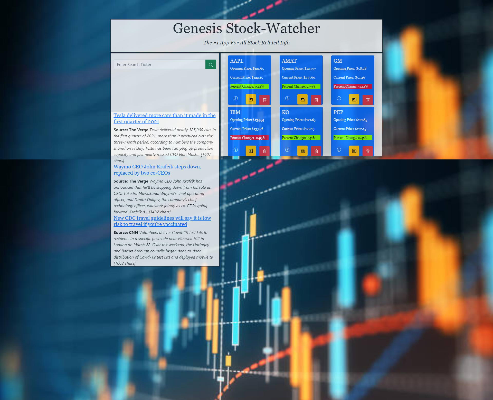
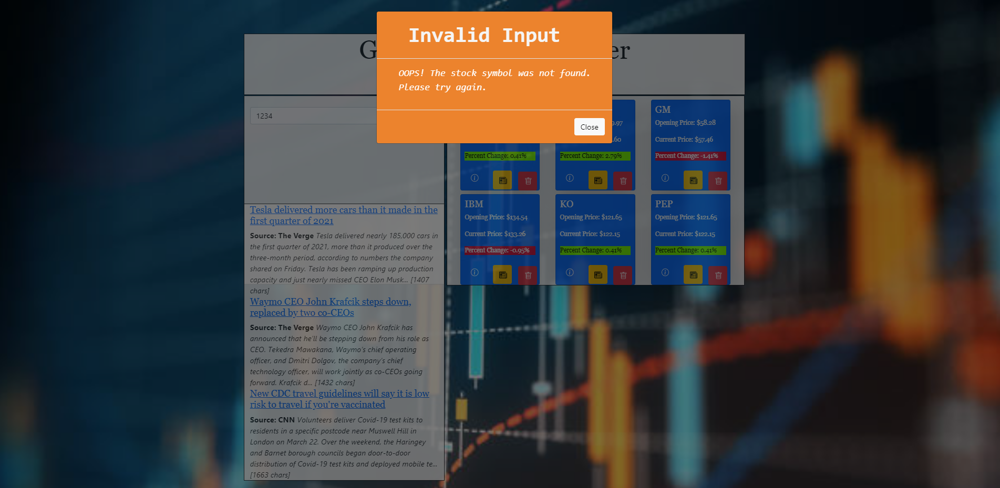

# Stock-Watcher ==> Team Genesis - Project 01

## Description

This project was to build a web app that will allow the user to have information on stocks at their finger tips. The app will feature dynamically updated HTML and CSS. It will use `localStorage` to store any persistent data.

```md
The app should operate within the following requirements:
1. The user can search a stock ticker and be shown:
    * Detailed stock information for the entered stock ticker.
    * A favorites panel showing info for the favorite stocks.
    * News for the stock ticker selected
2. The block that displays the detailed stock information should show:
    * Stock symbol
    * Exchange where it is traded
    * Opening price 
    * High stock price for current/last day traded 
    * Low stock price for current/last day traded
    * Last closing price
    * Percentage change (should be color coded to denote positive/negatve)
    * Volume traded for current/last day traded
    * A button to save to the favorites
3. The block that displays stock favorites should show:
    * Stock symbol
    * Opening price
    * Current price
    * Percentage change (should be color coded to denote postive/negative)
    * Buttons to allow:
        * Show stock info
        * Show news
        * Delete from favorites
4.  The searched stock ticker entered should be:
    * Capitalized appropriately
    * Prompted for corrections for entries that aren't valid ticker symbols
    * Also display news in the news section
```
## Table of Contents

* [Installation](#installation)
* [Usage](#usage)
* [Credits](#credits)
* [License](#license)
* [Badges](#badges)
* [Features](#features)
* [Contributing](#contributing)
* [Tests](#tests)


## Installation

```md
The following steps should be used to install:
1. Push code to GitHub repository
    * git add -A
    * git committ -m "descriptive message"
    * git push
2. Select the Settings in GitHub
    * Scroll down to the GitHub Pages section
    * Under Source select to use main branch as source
```

## Usage 

Navigate to:
[https://figfacts.github.io/Project_1_Genesis_Stock_Watcher/](https://figfacts.github.io/Project_1_Genesis_Stock_Watcher/)

**Images of App:**




## Credits
* Trilogy Education Services, LLC, a 2U, Inc. brand
* twelvedata.com
* gnews.io


## License

MIT License

Copyright (c) 2021 Team Genesis

Permission is hereby granted, free of charge, to any person obtaining a copy
of this software and associated documentation files (the "Software"), to deal
in the Software without restriction, including without limitation the rights
to use, copy, modify, merge, publish, distribute, sublicense, and/or sell
copies of the Software, and to permit persons to whom the Software is
furnished to do so, subject to the following conditions:

The above copyright notice and this permission notice shall be included in all
copies or substantial portions of the Software.

THE SOFTWARE IS PROVIDED "AS IS", WITHOUT WARRANTY OF ANY KIND, EXPRESS OR
IMPLIED, INCLUDING BUT NOT LIMITED TO THE WARRANTIES OF MERCHANTABILITY,
FITNESS FOR A PARTICULAR PURPOSE AND NONINFRINGEMENT. IN NO EVENT SHALL THE
AUTHORS OR COPYRIGHT HOLDERS BE LIABLE FOR ANY CLAIM, DAMAGES OR OTHER
LIABILITY, WHETHER IN AN ACTION OF CONTRACT, TORT OR OTHERWISE, ARISING FROM,
OUT OF OR IN CONNECTION WITH THE SOFTWARE OR THE USE OR OTHER DEALINGS IN THE
SOFTWARE.

## Badges


## Features

There are no special features on this page.

## Contributing
* Omari Grampus
* David Figueroa
* Justin Byrd
* Mark Harrison

## Tests

```md
Verify links work:
1. Enter a stock ticker in the _Search_ box and click on the search button (magnifying glass).
2. You should see detailed stock information.
3. The ticker you entered should retrieve and display current news.
4. Clicking on the information button on a favorites will display stock information.
```

```md
Verify page layout and that all images display.
```# Project_1_Genesis_Stock_Watcher
